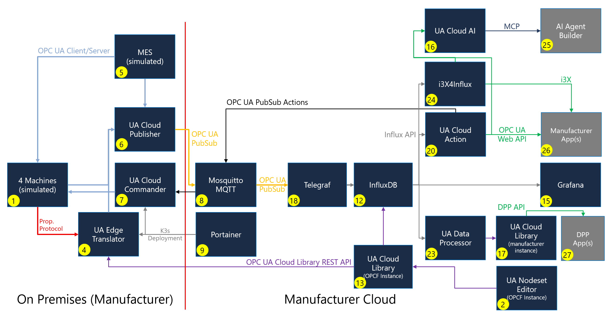

# Cloud Initiative Reference Solution

OPC Foundation Cloud Initiative Open-Source Reference Solution

## Table of Contents

- [Why This Solution](#why-this-solution)
  - [The Problem It Solves](#the-problem-it-solves)
  - [What You Can Do That You Couldn't Before](#what-you-can-do-that-you-couldnt-before)
  - [Zero Lock-In by Design](#zero-lock-in-by-design)
  - [Interoperability Through Open Standards](#interoperability-through-open-standards)
- [Reference Edge Hardware](#reference-edge-hardware)
- [Deploying the Software Stack](#deploying-the-software-stack)
  - [What the Stack Contains](#what-the-stack-contains)
  - [Install K3s](#install-k3s)
    - [Prerequisite: enable memory cgroups (Raspberry Pi only)](#prerequisite-enable-memory-cgroups-raspberry-pi-only)
  - [Apply the Stack Manifests](#apply-the-stack-manifests)
  - [Where Telemetry Data Is Persisted](#where-telemetry-data-is-persisted)
  - [Updating the Container Images](#updating-the-container-images)
- [Uninstalling](#uninstalling)
  - [Remove the Stack, Keep K3s](#remove-the-stack-keep-k3s)
  - [Remove the Persisted Data Too](#remove-the-persisted-data-too)
  - [Remove K3s Itself](#remove-k3s-itself)
- [Simulated Production Line](#simulated-production-line)
  - [Data Flows Immediately](#data-flows-immediately)
  - [Simulated Modbus TCP Device (Non-OPC UA)](#simulated-modbus-tcp-device-non-opc-ua)
    - [Automatic Onboarding via a WoT Thing Description](#automatic-onboarding-via-a-wot-thing-description)
    - [Each Asset Gets Its Own OPC UA Namespace](#each-asset-gets-its-own-opc-ua-namespace)
- [Automatic Certificate Provisioning (GDS Server Push)](#automatic-certificate-provisioning-gds-server-push)
  - [What Happens](#what-happens)
  - [Using It Manually](#using-it-manually)
- [Accessing the Web UIs](#accessing-the-web-uis)
- [Managing the Cluster with Portainer](#managing-the-cluster-with-portainer)
  - ["Your Portainer instance timed out for security purposes"](#your-portainer-instance-timed-out-for-security-purposes)
  - [Single Cluster vs. Split Edge/Cloud Deployment](#single-cluster-vs-split-edgecloud-deployment)
- [Inspecting the Broker with MQTT Explorer](#inspecting-the-broker-with-mqtt-explorer)
- [Self-Hosted UA Cloud Library](#self-hosted-ua-cloud-library)
  - [Registration and the Disabled Email Verification](#registration-and-the-disabled-email-verification)
  - [First Login: Register with Your IOT_USERNAME](#first-login-register-with-your-iot_username)
- [UA Data Processor (PCF and Battery Passport)](#ua-data-processor-pcf-and-battery-passport)
- [Pre-Provisioned Grafana Dashboards](#pre-provisioned-grafana-dashboards)
  - [Reading the Production Line OEE Dashboard](#reading-the-production-line-oee-dashboard)
  - [Production Shifts and Choosing the Grafana Time Range](#production-shifts-and-choosing-the-grafana-time-range)
  - [Reading the UA Cloud Publisher Diagnostics Dashboard](#reading-the-ua-cloud-publisher-diagnostics-dashboard)
- [Tutorials](#tutorials)
  - [Onboarding an OPC UA Device](./tutorial-onboarding-opcua-device.md)
  - [Onboarding a Non-OPC UA Device](./tutorial-onboarding-non-opcua-device.md)
  - [Querying Data in the InfluxDB Dashboard](./tutorial-influxdb-queries.md)
  - [Dashboards with Grafana](./tutorial-grafana-dashboards.md)
  - [Calculating OEE](./tutorial-oee.md)
  - [Importing an OPC UA Information Model](./tutorial-import-information-model.md)
  - [Command & Control with UA Cloud Commander](./tutorial-command-and-control.md)
  - [Building Custom Apps for the Reference Solution](./tutorial-building-custom-apps.md)
- [Security Analysis (STRIDE)](#security-analysis-stride)
  - [Trust Boundaries and Assets](#trust-boundaries-and-assets)
  - [STRIDE Threat Assessment](#stride-threat-assessment)
  - [Production Hardening Recommendations](#production-hardening-recommendations)

## Why This Solution

Industrial data is trapped. It sits in machines that speak dozens of incompatible
protocols, behind gateways you don't control, in platforms that charge for
every tag and make leaving expensive. Connecting a factory for data analytics and AI today
usually means picking a vendor — and then living with their protocols, their data
model, their pricing, and their roadmap for decades.

**This reference solution shows there is another way.** It is a complete,
higly scalable, end-to-end industrial IoT stack — from the sensor on the shop floor to a
queryable time-series dashboard and back down to a command that actuates a
machine — built entirely from **open standards** and **open-source components**.
You can deploy it today, on hardware you own, with no subscription fee.

### The Problem It Solves

| Problem | How this solution addresses it |
|---|---|
| **Protocol fragmentation** — every machine speaks something different (Modbus, BACnet, OPC DA/AE, Siemens S7, Rockwell, Beckhoff, Mitsubishi, IEC 61850, OCPP, LoRaWAN, Matter, Redfish, HTTP/REST…) | The **UA Edge Translator** normalises all of them into a single OPC UA information model, using **W3C Web of Things (WoT) Thing Descriptions** as the declarative, vendor-neutral mapping format — no custom code per device. |
| **Data without meaning** — most IoT pipelines ship anonymous numbers that need out-of-band documentation to interpret | Data flows as **OPC UA PubSub** with accompanying **metadata messages**, so every value arrives with its type, semantics, and source. Full **OPC UA Information Models** can be imported from the **UA Cloud Library** so you know what a machine *could* report, not just what it happens to send. |
| **Vendor lock-in** — proprietary apps, proprietary payload formats, and egress/ingest pricing that grows with your data | Every component is open source and speaks **standard MQTT** with **standard OPC UA PubSub JSON** payloads. Point it at any broker, any database, any cloud — or keep it entirely on-premises. |
| **Read-only pipelines** — telemetry goes up, but nothing can come back down safely | **UA Cloud Commander** implements the spec-compliant **OPC UA PubSub Actions** request/response pattern, so cloud or local applications can securely **read, write, call methods, and read history** on shop-floor servers. |
| **No closed loop** — insights stay in dashboards instead of driving action | **UA Cloud Action** watches the time-series data and automatically triggers OPC UA method calls when thresholds are crossed — a genuine **digital feedback loop**, running at the edge with no cloud dependency. |
| **Certificate management pain** — OPC UA security is often disabled because provisioning trust is tedious | **GDS Server Push** provisions certificates and trust lists automatically, so the stack runs *secure by default* instead of secure-in-theory. |
| **Hard to evaluate** — pilots stall because getting *any* data flowing takes days if not weeks | A **simulated production line** ships with the stack. Apply two manifests and real OPC UA telemetry is flowing into dashboards within minutes — no hardware required to start. |

### What You Can Do That You Couldn't Before

- **Connect a brownfield machine without learning a custom UI and a proprietary asset description language from a connectivity provider.** Describe it once in a WoT
  Thing Description and it appears as a fully-modelled OPC UA server automatically.
- **Move your entire data pipeline between clouds — or off the cloud — in an
  afternoon.** Because the wire formats are open standards, the broker, database,
  and dashboards are all replaceable parts, not a platform you're bound to.
- **Close the loop from analytics back to the machine**, using a standardised,
  auditable command pattern rather than a bespoke integration.
- **Build your own applications against a standard REST API.** The OPC UA Web API
  (OpenAPI-based) lets any language talk to your OPC UA estate over plain HTTP/JSON.
- **Run the whole thing in under a minute on a less than $300 industrial PC** — or scale the same manifests
  across a fleet, or split them between edge and cloud clusters. Same code, same
  standards.

### Zero Lock-In by Design

- **100% open source.** Every component — UA Edge Translator, UA Cloud Publisher,
  UA Cloud Commander, UA Cloud Action, Mosquitto, Telegraf, InfluxDB, Grafana,
  Portainer — is open source. There are no subscription fees, no per-message
  costs, no seat counts, and no expiring trials. Fork it, audit it, extend it.
  > You still own the total cost of ownership: the hardware and
  > the effort to operate, patch, and support the stack yourself. What you avoid is
  > recurring licence and consumption billing — and the dependency that comes with it.
- **Runs anywhere.** It is plain Kubernetes (K3s). Deploy it on a Raspberry Pi in
  a control cabinet, a rack server in your own data center, or a managed
  Kubernetes service in any public cloud. The [edge/cloud split](#deploying-the-software-stack)
  lets you draw the boundary wherever your architecture and data-sovereignty rules
  require — including fully air-gapped.
- **Vendor independence.** Nothing here depends on a specific PLC vendor, cloud
  provider, historian, or dashboard tool. Each box in the pipeline is swappable
  because the interfaces between them are public specifications, not private APIs.
- **No proprietary payloads.** What goes over the wire is OPC UA PubSub JSON over
  MQTT — documented, inspectable, and consumable by anything.

### Interoperability Through Open Standards

Open standards are used *throughout* the stack, not just at the edges:

| Standard | Where it is used |
|---|---|
| **OPC UA** (IEC 62541 series) | The information model and the security model for all shop-floor connectivity. |
| **OPC UA PubSub** (IEC 62541-14) | The telemetry wire format (JSON over MQTT), including metadata messages. |
| **OPC UA Actions** (IEC 62541-14) | The command & control request/response pattern used by Cloud Commander and Cloud Action. |
| **OPC UA GDS Server Push** (IEC 62541-12) | Automated certificate and trust-list provisioning. |
| **OPC UA Web API** (IEC 62541-4, OpenAPI) | The RESTful interface for building custom applications — an OpenAPI representation of the OPC UA Services. |
| **W3C Web of Things (WoT)** (W3C Recommendation) | Thing Descriptions that declaratively map non-OPC UA assets into OPC UA. |
| **MQTT 5.0** (OASIS) | The messaging transport, with TLS and authentication. MQTT v5 features (Correlation Data, Response Topic, Message Expiry) carry the request/response correlation for OPC UA Actions. |
| **EN 18222** (CEN/CENELEC) | Digital Product Passport data model and unique identifiers — the structure of the DPPs that UA Data Processor generates and stores in the UA Cloud Library. |
| **EN 18223** (CEN/CENELEC) | Digital Product Passport system architecture and data exchange — how DPPs are stored and retrieved by downstream consumers (customer, recycler, regulator) over the Cloud Library's REST API. |
| **Kubernetes** (CNCF) | The deployment and operations model. |

Because these are *published specifications* rather than product features, any
conforming tool — from any vendor — can participate in this architecture. That is
the difference between an integration and an ecosystem.

> **Evaluating this for your organisation?** Start with
> [Deploying the Software Stack](#deploying-the-software-stack): two `kubectl apply`
> commands bring up the full pipeline plus a
> [simulated production line](#simulated-production-line), so you can see live data
> in Grafana before committing any hardware. A
> [STRIDE security analysis](#security-analysis-stride) and
> [production hardening guidance](#production-hardening-recommendations) are
> included to support an enterprise architectural review.

## Reference Edge Hardware

The reference solution runs on any 64-bit Linux host capable of running K3s.
For a validated, industrial-grade edge gateway we **recommend** a fanless
Raspberry Pi Compute Module 5 (CM5) industrial PC — see
**[hardware.md](./hardware.md)** for the recommended bill of materials, SSD
imaging, assembly, and first-boot instructions.

## Deploying the Software Stack

The reference workload is split into two manifests that run on a lightweight
Kubernetes cluster (**K3s**):

| Manifest | Namespace | Components |
|----------|-----------|------------|
| [`edge.yaml`](./edge.yaml) | `edge` | UA Edge Translator, UA Cloud Publisher, UA Cloud Commander |
| [`edge.yaml`](./edge.yaml) | `munich` | Simulated production line (MES, assembly, test, packaging stations) |
| [`cloud.yaml`](./cloud.yaml) | `cloud` | Mosquitto, Telegraf, InfluxDB, Grafana, Portainer, UA Cloud Action |

The **edge** part contains the components that sit next to the machines and speak
OPC UA / industrial protocols, plus a **simulated production line** so the stack
produces real OPC UA telemetry out of the box (see
[Simulated Production Line](#simulated-production-line)). The **cloud** part
contains the broker, storage, visualization, and management components that would
typically run in a data center or public cloud.

> **For convenience, everything can be installed on a single K3s instance** 
> Simply apply both manifests to the same cluster; the two namespaces
> keep the edge and cloud workloads logically separated while they share one node.
> In a distributed deployment, apply `edge.yaml` to the edge cluster and
> `cloud.yaml` to the cloud cluster, and update the cross-namespace service DNS
> names (see *Apply the Stack Manifests*) to point at the remote endpoints.

### What the Stack Contains

Together, `edge.yaml` and `cloud.yaml` deploy the following components, forming an
end-to-end pipeline from industrial protocols to a time-series database.

**Workloads**

| Component | Namespace | Image | Ports |
|---|---|---|---|
| **ua-edgetranslator** | `edge` | `ghcr.io/opcfoundation/ua-edgetranslator:main` | 4840, 5000/5001, 19520/19521, **8080 (UI)** |
| **ua-cloudpublisher** | `edge` | `ghcr.io/barnstee/ua-cloudpublisher:main` | **8081 (UI)** |
| **ua-cloudcommander** | `edge` | `ghcr.io/opcfoundation/ua-cloudcommander:main` | — |
| **mes**, **assembly**, **test**, **packaging** | `munich` | `ghcr.io/digitaltwinconsortium/manufacturingontologies:main` | 4840 (each) |
| **modbus-simulator** | `munich` | `python:3.12-slim` | 502 (Modbus TCP) |
| **mosquitto** | `cloud` | `eclipse-mosquitto:2.1.2-alpine` | 8883 (MQTT/TLS) |
| **mqtt-explorer** | `cloud` | `smeagolworms4/mqtt-explorer:browser-1.0.3` | **4000 (UI)** |
| **telegraf** | `cloud` | `telegraf:1.39-alpine` | — |
| **influxdb** | `cloud` | `influxdb:2.9` | **8086 (UI/API)** |
| **grafana** | `cloud` | `grafana/grafana:13.1.1` | **3000 (UI)** |
| **ua-cloudaction** | `cloud` | `ghcr.io/opcfoundation/ua-cloudaction:main` | **8082 (UI/Web API)** |
| **ua-cloudlibrary** | `cloud` | `ghcr.io/opcfoundation/ua-cloudlibrary:latest` | **8083 (UI/REST)** |
| **cloudlib-postgres** | `cloud` | `postgres:17.6-alpine` | 5432 (ClusterIP only) |
| **ua-dataprocessor** | `cloud` | `ghcr.io/opcfoundation/ua-dataprocessor:main` | — |
| **portainer** | `cloud` | `portainer/portainer-ce:2.44.0` | **9443 (HTTPS UI)**, 9000, 8000 |

**What each component does**

- **ua-edgetranslator** — OPC Foundation *UA Edge Translator*. Connects to
  southbound assets and translates protocols (LoRaWAN, OCPP, etc.) into an OPC UA
  information model. Exposes a web UI for configuration.
- **ua-cloudpublisher** — *UA Cloud Publisher*. Subscribes to OPC UA data (from the
  Edge Translator or the simulated line) and publishes it as **OPC UA PubSub** JSON
  messages to the MQTT broker. Exposes a web UI for configuration.
- **ua-cloudcommander** — OPC Foundation *UA Cloud Commander*, the command & control
  **Responder**. Subscribes to `commands/#` for `ua-action-request` messages,
  executes OPC UA operations (Read, HistoricalRead, Write, MethodCall) against
  on-premises OPC UA servers, and replies on the `responses` topic. No web UI.
- **mes / assembly / test / packaging** — the **simulated production line "Munich"**:
  four OPC UA servers modelling a factory line (MES shift schedule plus assembly,
  test and packaging stations), providing live telemetry out of the box. See
  [Simulated Production Line](#simulated-production-line).
- **modbus-simulator** — a **simulated Modbus TCP device** on the Munich line,
  automatically mapped into OPC UA by the Edge Translator via a W3C WoT Thing
  Description. See [Simulated Modbus TCP Device](#simulated-modbus-tcp-device-non-opc-ua).
- **mosquitto** — *Eclipse Mosquitto* MQTT broker carrying the OPC UA PubSub `data/#`
  and `metadata` messages. Configured via `mosquitto-conf` with a TLS listener on
  8883 and username/password authentication (`allow_anonymous false`) using the
  `IOT_USERNAME` / `IOT_PASSWORD` supplied at apply time.
- **mqtt-explorer** — *MQTT Explorer*, a browser-based client for inspecting the
  broker: browse the live topic tree, read the OPC UA PubSub payloads on `data/#`
  and `metadata`, and publish messages by hand. The broker connection is
  pre-seeded, so it connects with one click. ⚠️ It has **no authentication of its
  own** — see *Inspecting the Broker with MQTT Explorer*.
- **telegraf** — *Telegraf* agent that consumes the MQTT PubSub messages, parses them
  with the `json_v2` parser (from the `telegraf-conf` ConfigMap), and writes them to
  InfluxDB as the `opcua_pubsub` (data) and `opcua_metadata` (metadata) measurements.
- **influxdb** — *InfluxDB 2.x* time-series database storing the telemetry.
  Initialized with org `iot`, bucket `mqtt`, and an admin user set to your
  `IOT_USERNAME`. Includes a web UI (Data Explorer / dashboards).
- **grafana** — *Grafana* dashboarding & alerting UI with a **pre-provisioned
  InfluxDB data source** (Flux, org `iot`, bucket `mqtt`) and three **pre-provisioned
  dashboards** ("Production Line OEE", "Modbus Simulator" and "UA Cloud Publisher
  Diagnostics") — see *Pre-Provisioned Grafana Dashboards*.
- **ua-cloudaction** — OPC Foundation *UA Cloud Action*, the command & control
  **Requestor**. Polls a configured InfluxDB field and, when it crosses a threshold,
  publishes a `ua-action-request` (MethodCall) to the `commands` topic for Cloud
  Commander to execute — closing the digital feedback loop. Also hosts a status web
  UI and the [OPC UA Web API](./tutorial-building-custom-apps.md#accessing-the-opc-ua-web-api-ua-cloud-action).
- **portainer** — *Portainer CE*, a web UI to manage the K3s cluster (workloads,
  logs, shells, events). Runs under a `cluster-admin`-bound ServiceAccount.
- **ua-cloudlibrary** — a **self-hosted [UA Cloud Library](https://github.com/OPCFoundation/UA-CloudLibrary)**,
  the OPC Foundation's store of OPC UA Information Models. Running it locally
  means models can be resolved without reaching out to the public
  [uacloudlibrary.opcfoundation.org](https://uacloudlibrary.opcfoundation.org),
  which matters for air-gapped installations or when storing private models. It can also be used to store EU Digital Product Passports, which is the use case leveraged here. It has a Web UI plus a REST API.
- **cloudlib-postgres** — *PostgreSQL*, the Cloud Library's backing store. It
  holds **both** the relational data and the uploaded nodeset files (there is no
  separate blob store), so it is the single source of truth for everything you
  upload. `ClusterIP` only — never exposed on the node.
- **ua-dataprocessor** — *UA Data Processor*, a headless worker that reads the
  OPC UA telemetry back out of InfluxDB and calculates a **Product Carbon
  Footprint (PCF)** and a **Digital Battery Passport**, publishing the results as
  OPC UA Information Models into the Cloud Library above.

**Configuration resources**

| Resource | Kind | Purpose |
|---|---|---|
| `influxdb-auth` | Secret | Holds the `INFLUX_TOKEN` used by InfluxDB (admin), Telegraf (write), Grafana (query), and UA Cloud Action (query). Supplied at deploy time via `${INFLUX_TOKEN}`. |
| `telegraf-conf` | ConfigMap | Telegraf configuration (MQTT inputs + InfluxDB output). |
| `mosquitto-conf` | ConfigMap | Mosquitto broker configuration (TLS listener, authentication, persistence). |
| `ua-cloudpublisher-settings` | ConfigMap | Seeds the Publisher's `settings.json` (broker connection, topics, metadata) and `persistency.json` (published nodes for the simulated line) on first start. |
| `modbus-simulator` | ConfigMap | The Python Modbus TCP simulation server run by the simulated device. |
| `modbus-thing-description` | ConfigMap | W3C WoT Thing Description seeded into UA Edge Translator so the Modbus device is onboarded as an OPC UA asset at startup. |
| `grafana-datasources`, `grafana-dashboard-provider`, `grafana-dashboards` | ConfigMaps | Provision the InfluxDB data source and the three dashboards (*Production Line OEE*, *Modbus Simulator*, *UA Cloud Publisher Diagnostics*). |
| `opcua-model-importer` | ConfigMap | Importer script for [loading OPC UA Information Models](./tutorial-import-information-model.md) from the UA Cloud Library. |
| `portainer-sa-clusteradmin` / `portainer-crb-clusteradmin` | ServiceAccount / ClusterRoleBinding | Grant Portainer in-cluster access to the K3s API server. |
| `cloudlib-postgres-auth` | Secret | PostgreSQL database name, user and password for the UA Cloud Library. Reuses `${IOT_USERNAME}` / `${IOT_PASSWORD}`. |

**Data flow**



> **Security note:** you choose the credentials at deployment time via the
> `IOT_USERNAME` / `IOT_PASSWORD` variables (see *Apply the Stack Manifests*),
> used consistently across the Edge Translator,
> Cloud Publisher, Cloud Commander, Mosquitto, and InfluxDB for demo purposes.
> Mosquitto uses a
> self-signed TLS certificate generated at pod startup.
> Change these and use certificates from a trusted CA before any production or
> exposed deployment.

### Install K3s

#### Prerequisite: enable memory cgroups (Raspberry Pi only)

Raspberry Pi OS ships with the **memory cgroup controller disabled**, but
K3s/containerd requires it. Enable it and reboot **before** installing K3s:

```bash
# NOTE: cmdline.txt must stay a SINGLE line - append, don't add a new line.
sudo sed -i '1 s/$/ cgroup_memory=1 cgroup_enable=memory/' /boot/firmware/cmdline.txt

# On Raspberry Pi OS older than Bookworm the file is /boot/cmdline.txt instead.

sudo reboot now
```

Once the device has booted and been updated, install K3s

```bash
# Install a single-node K3s cluster (server + agent on the same node)
curl -sfL https://get.k3s.io | sh -

# Verify the node is Ready (may take ~30s)
sudo k3s kubectl get nodes
```

To use the standard `kubectl` command and the `KUBECONFIG` without `sudo`:

```bash
mkdir -p ~/.kube
sudo cp /etc/rancher/k3s/k3s.yaml ~/.kube/config
sudo chown "$(id -u):$(id -g)" ~/.kube/config
export KUBECONFIG=~/.kube/config
echo 'export KUBECONFIG=~/.kube/config' >> ~/.bashrc

kubectl get nodes -A
```

> K3s ships with the **Traefik** ingress controller and a built-in
> **ServiceLB (klipper-lb)** load balancer, so the `type: LoadBalancer`
> Services in the manifest are reachable directly on the node's IP address.

### Apply the Stack Manifests

1. Download `edge.yaml` and `cloud.yaml` onto the device:

   ```bash
   curl -fsSLO https://raw.githubusercontent.com/OPCF-Members/Cloud-Initiative-Reference-Solution/main/edge.yaml
   curl -fsSLO https://raw.githubusercontent.com/OPCF-Members/Cloud-Initiative-Reference-Solution/main/cloud.yaml
   ```

2. Provide the deployment credentials and InfluxDB token. The manifests
   reference `${IOT_USERNAME}`, `${IOT_PASSWORD}`, and `${INFLUX_TOKEN}`, so set
   them and substitute them at apply time:

   ```bash
   # Choose the shared username/password used by the Edge Translator,
   # Cloud Publisher, Mosquitto broker, and InfluxDB.
   # NOTE: InfluxDB requires the password to be at least 8 characters.
   export IOT_USERNAME="myUsername"
   export IOT_PASSWORD="ChangeMe123"

   # Generate a random InfluxDB token (or supply your own)
   export INFLUX_TOKEN="$(openssl rand -hex 32)"

   # Substitute ONLY these variables and apply. Restricting the variable list is
   # important so envsubst does not touch the runtime shell variables (e.g.
   # $MOSQUITTO_USERNAME) used inside the container start-up commands.
   # Apply the cloud part first so the broker and database exist for the edge part.
   envsubst '${IOT_USERNAME} ${IOT_PASSWORD} ${INFLUX_TOKEN}' < cloud.yaml | kubectl apply -f -
   envsubst '${IOT_USERNAME} ${IOT_PASSWORD} ${INFLUX_TOKEN}' < edge.yaml  | kubectl apply -f -
   ```

   > `envsubst` is part of the `gettext` package (`sudo apt install -y gettext-base`).
   > Keep the values you chose — you'll reuse `IOT_USERNAME` / `IOT_PASSWORD` to
   > log into the web UIs and the broker, and the generated `INFLUX_TOKEN` to
   > authenticate Telegraf and log into InfluxDB via the API.

   > **Lost the token, or re-applying later?** It is stored in the `influxdb-auth`
   > Secret, so you can read it back out of the cluster rather than generating a
   > new one:
   >
   > ```bash
   > export INFLUX_TOKEN="$(kubectl get secret influxdb-auth -n cloud \
   >   -o go-template='{{.data.INFLUX_TOKEN | base64decode}}')"
   > ```
   >
   > `base64decode` runs inside the Go template, so this needs no external `base64`
   > binary and works the same from Linux, macOS and Windows PowerShell.
   >
   > **Always do this before re-applying the manifests.** Generating a fresh token
   > only rewrites the Secret — InfluxDB keeps the admin token it was initialised
   > with, so Telegraf, Grafana and UA Cloud Action would all suddenly fail to
   > authenticate against a database that never changed.

   > **Deploying edge and cloud on separate clusters?** The manifests reference each
   > other by in-cluster DNS (`mosquitto.cloud.svc.cluster.local`,
   > `influxdb.cloud.svc.cluster.local`, and
   > `ua-edgetranslator.edge.svc.cluster.local`). If the two halves run in different
   > clusters, replace those names with the externally reachable addresses of the
   > remote services before applying.

3. Watch the workloads come up (each part lives in its own namespace):

   ```bash
   kubectl get pods,svc -n cloud
   kubectl get pods,svc -n edge
   # or watch everything at once
   kubectl get pods -A -w
   ```

   All pods should reach `Running`/`Ready`, and each `LoadBalancer` Service should
   receive an `EXTERNAL-IP` (the node's IP).

   If the external IP address for some Kubernetes services shows as `<pending>`, use the following command to assign the external IP address of the traefik service: sudo kubectl patch service <theService> -p '{"spec": {"type": "LoadBalancer", "externalIPs":["<the traefik external IP address>"]}}'.

### Where Telemetry Data Is Persisted

The ingested OPC UA telemetry is stored by **InfluxDB** in the `mqtt` bucket. That
database is backed by a Kubernetes `hostPath` volume, so the data lives directly
on the Pi's NVMe SSD at:

```
/influxdb2
```

Because this is a host directory (not ephemeral pod storage), the telemetry
**survives pod restarts, redeploys, and reboots**. 

Related OPC UA telemetry persistence paths are also mapped as `hostPath` volumes on the Pi:

| Path on the Pi | Component | Contents |
|----------------|-----------|----------|
| `/influxdb2` | InfluxDB | Time-series telemetry, buckets, and InfluxDB config (the primary telemetry store). |
| `/translator/settings`, `/translator/nodesets`, `/translator/pki`, `/translator/logs` | UA Edge Translator | Configuration, OPC UA nodesets, certificates, and logs. |
| `/publisher/settings`, `/publisher/pki`, `/publisher/logs`, `/publisher/store` | UA Cloud Publisher | Configuration, certificates, logs, and the Store & Forward message store (queued messages held during broker/connectivity outages). |
| `/commander/pki`, `/commander/logs` | UA Cloud Commander | OPC UA client certificates and logs. |
| `/productionline/munich/<station>/pki`, `/productionline/munich/<station>/logs` | Simulated production line | OPC UA server certificates and logs for each simulated station (`mes`, `assembly`, `test`, `packaging`). |
| `/mosquitto` | Mosquitto | Broker persistence database (`mosquitto.db`: retained messages and queued messages for persistent sessions). |
| `/portainer` | Portainer | Portainer database, users, and settings. |
| `/grafana` | Grafana | Grafana database, users, and user-created dashboards. |
| `/cloudlib-postgres` | UA Cloud Library (PostgreSQL) | The Cloud Library's entire state: user accounts **and** every uploaded OPC UA nodeset. This directory is the only thing to back up — and deleting it discards every model you uploaded. |

> **Note:** Keep the `INFLUX_TOKEN` safe, to read the telemetry stored in InfluxDB in backup scenarios.
>
> If you no longer have it, retrieve it from the cluster — it is held in the
> `influxdb-auth` Secret:
>
> ```bash
> kubectl get secret influxdb-auth -n cloud -o go-template='{{.data.INFLUX_TOKEN | base64decode}}'; echo
> ```
>
> `base64decode` runs inside the Go template, so this needs no external `base64`
> binary and works the same from Linux, macOS and Windows PowerShell. Use the
> token to query the API directly, for example to list the buckets:
>
> ```bash
> TOKEN=$(kubectl get secret influxdb-auth -n cloud -o go-template='{{.data.INFLUX_TOKEN | base64decode}}')
> kubectl exec -n cloud deploy/influxdb -- influx bucket list --org iot --token "$TOKEN"
> ```
>
> This is an **all-access admin token**: it can read and delete every bucket in
> the org. Treat it as a secret and see
> [Production Hardening Recommendations](#production-hardening-recommendations)
> for scoping it down.

### Updating the Container Images

All containers use **`imagePullPolicy: IfNotPresent`** so the stack can be
deployed and restarted on an air-gapped network without reaching a registry.

Most images are pinned to an explicit version (`grafana/grafana:13.1.1`,
`influxdb:2.9`, …), so bumping one means editing the tag in the manifest and
re-applying — the new tag is not in the local cache, so K3s fetches it.

**The following four OPC Foundation and two external components are different.** They track a floating
`:main` tag:

```
ghcr.io/opcfoundation/ua-edgetranslator:main
ghcr.io/opcfoundation/ua-edgetranslator-drivers:main
ghcr.io/opcfoundation/ua-cloudcommander:main
ghcr.io/opcfoundation/ua-cloudaction:main
ghcr.io/barnstee/ua-cloudpublisher:main
ghcr.io/digitaltwinconsortium/manufacturingontologies:main
```

Because the tag never changes, `IfNotPresent` means K3s keeps using the copy it
already has. **A `kubectl rollout restart` will not pick up a new build** — it
re-creates the pod from the same cached image.

Updating therefore takes two steps, in this order: **scale the workload down so
the image is no longer in use, then delete it.** `crictl` refuses to remove an
image that a running container references, so deleting first silently does
nothing.

```bash
# 1. stop the workload so its image becomes unused
kubectl scale deployment/ua-cloudpublisher -n edge --replicas=0
kubectl wait --for=delete pod -l app=ua-cloudpublisher -n edge --timeout=120s

# 2. drop the cached image
sudo k3s crictl --timeout=5m rmi ghcr.io/barnstee/ua-cloudpublisher:main

# 3. start it again - the image is gone, so this pulls the current :main
kubectl scale deployment/ua-cloudpublisher -n edge --replicas=1
kubectl rollout status deployment/ua-cloudpublisher -n edge
```

> **`sudo k3s crictl rmi --prune` is not a shortcut for this.** It removes only
> images that **no running container is using**, so every image you actually care
> about updating is skipped. It is useful for reclaiming disk space after a
> version bump has left old tags behind, not for refreshing a running component.

To rebuild the whole stack on current images, delete the namespaces first — then
nothing is running and a prune clears everything:

```bash
kubectl delete namespace cloud edge munich --ignore-not-found
kubectl get ns -w                            # Ctrl+C once all three have gone
sudo k3s crictl --timeout=5m rmi --prune     # now genuinely removes every stack image
envsubst '${IOT_USERNAME} ${IOT_PASSWORD} ${INFLUX_TOKEN}' < cloud.yaml | kubectl apply -f -
envsubst '${IOT_USERNAME} ${IOT_PASSWORD}' < edge.yaml | kubectl apply -f -
```

> Updating obviously requires registry access — on an air-gapped node, side-load
> the new image with `sudo k3s ctr images import <file>.tar` instead, which
> replaces the cached copy without needing to delete it first.

## Uninstalling

### Remove the Stack, Keep K3s

Deleting the three namespaces stops and removes every workload:

```bash
kubectl delete namespace cloud edge munich --ignore-not-found
kubectl get ns -w      # Ctrl+C once all three have gone
```

> Namespace deletion occasionally stalls on finalizers. If one sits in
> `Terminating` for more than a minute or two, inspect what is left with
> `kubectl get all -n <namespace>` before forcing anything.

**This does not delete your data.** Every path in the table under
[Where Telemetry Data Is Persisted](#where-telemetry-data-is-persisted) is a
`hostPath` on the Pi and survives. Re-applying the manifests brings the stack
back up with the same telemetry, certificates, users and dashboards.

### Remove the Persisted Data Too

To start genuinely from scratch — new certificates, empty database, fresh admin
accounts — also delete the host directories:

```bash
sudo rm -rf /mosquitto /influxdb2 /portainer /grafana /cloudlib-postgres
sudo rm -rf /translator /publisher /commander /productionline
```

> ⚠️ This is irreversible. It destroys all recorded telemetry, the InfluxDB
> admin token, the Mosquitto CA and password file, **every OPC UA
> certificate and trust list** — the stations, Publisher, Translator and
> Commander all mint new identities and re-establish trust on the next start —
> and **every nodeset uploaded to the UA Cloud Library, together with its user
> accounts**.
> Save your `INFLUX_TOKEN` first if you still need to read the old data.

### Remove K3s Itself

To return the Pi to a plain OS install:

```bash
sudo /usr/local/bin/k3s-uninstall.sh
```

That stops the service, removes the binary, the cluster state under
`/var/lib/rancher/k3s`, and all cached container images. It does **not** touch
the `hostPath` directories above (delete them separately, as shown), nor the
`cgroup_memory=1 cgroup_enable=memory` parameters added to
`/boot/firmware/cmdline.txt` during
[Install K3s](#install-k3s) — harmless to leave in place, but remove them by hand
if you want the boot configuration back exactly as it was.

## Simulated Production Line

So that the stack produces meaningful OPC UA telemetry immediately — without any
physical machines — `edge.yaml` also deploys a **software-only factory simulation**.

One production line, named **Munich**, is deployed into its own `munich`
namespace. It consists of four OPC UA servers:

| Station | Role | OPC UA endpoint |
|---------|------|-----------------|
| **mes** | Manufacturing Execution System — drives the shift schedule (Morning / Afternoon / Night) for the line. | `opc.tcp://mes.munich/` |
| **assembly** | Assembly station (200 W, 6 s cycle time). | `opc.tcp://assembly.munich/` |
| **test** | Test station (100 W, 6 s cycle time). | `opc.tcp://test.munich/` |
| **packaging** | Packaging station (100 W, 6 s cycle time). | `opc.tcp://packaging.munich/` |

Each station simulates a real machine, exposing OPC UA variables such as
production status, pressure, energy consumption, and product counts, and it
implements OPC UA methods (e.g. opening a pressure relief valve) that the
[command & control path](./tutorial-command-and-control.md) can invoke.

> The stations run in the `munich` namespace on purpose: their in-cluster DNS
> names (`mes.munich`, `assembly.munich`, …) then match the OPC UA application
> URIs the stations advertise, so the endpoint URLs in the Publisher's
> configuration resolve without modification.

The line follows a three-shift schedule and is **idle outside those shifts**, so
telemetry pauses during the daily breaks. This matters when reading OEE — see
[Production Shifts and Choosing the Grafana Time
Range](#production-shifts-and-choosing-the-grafana-time-range).

### Data Flows Immediately

UA Cloud Publisher is pre-seeded with a **published-nodes persistency file**
listing the nodes to subscribe to on each station, **plus the
Modbus variables that UA Edge Translator maps into OPC UA**. Because the seeded
`settings.json` sets `AutoLoadPersistedNodes: true`, the Publisher loads this
list on startup and begins publishing OPC UA PubSub messages to Mosquitto right
away — telemetry appears in InfluxDB and Grafana without any manual onboarding.

To guarantee correct start-up order, the Publisher pod runs two init containers
that block until their dependencies are accepting OPC UA connections on port 4840:
**`wait-for-productionline`** (all four stations) and
**`wait-for-edgetranslator`** (the Edge Translator, which serves the mapped
Modbus asset):

```bash
# watch the simulation come up
kubectl get pods -n munich -w

# the Publisher stays in Init: until the line and the translator are ready
kubectl get pods -n edge
kubectl logs -n edge deploy/ua-cloudpublisher -c wait-for-productionline
kubectl logs -n edge deploy/ua-cloudpublisher -c wait-for-edgetranslator
```

Both seeded files are only copied if they are not already present, so any changes
you later make through the Publisher UI are preserved across restarts.

### Simulated Modbus TCP Device (Non-OPC UA)

The Munich line also includes a **simulated Modbus TCP device** — a "line
conditioning unit" — to demonstrate the other half of the story: bringing a
**non-OPC UA** asset into the OPC UA world *without writing any code*.

It is a small, dependency-free Modbus TCP server (Python standard library only,
so it runs on arm64 and offline) exposing continuously changing registers at
`modbus-simulator.munich.svc.cluster.local:502`, unit id `1`:

| Register | Address | Modbus type | Value |
|---|---|---|---|
| Temperature | Holding 0–1 | float32 | Process temperature (°C) |
| Pressure | Holding 2–3 | float32 | Process pressure (bar) |
| FlowRate | Holding 4–5 | float32 | Coolant flow (l/min) |
| EnergyConsumption | Holding 6–7 | float32 | Cumulative energy (kWh) |
| MotorSpeed | Holding 8 | int16 | Motor speed (rpm) |
| MachineState | Holding 9 | int16 | 0 = stopped, 1 = running, 2 = fault |
| Running | Coil 0 | bool | True while running |
| FaultActive | Coil 1 | bool | True during a high-pressure fault |

#### Automatic Onboarding via a WoT Thing Description

The device is described by a **W3C WoT Thing Description** shipped in the
`modbus-thing-description` ConfigMap. UA Edge Translator loads **every `*.jsonld`
file in its `settings` folder at startup** and onboards it as an OPC UA asset, so
the Modbus registers appear as browsable, subscribable OPC UA variables on
`opc.tcp://<device-ip>:4840` with no manual configuration.

The TD carries the Modbus binding on each property's `forms` entry:

```jsonc
"base": "modbus+tcp://modbus-simulator.munich.svc.cluster.local:502/1",  // trailing /1 = unit id
"forms": [{
  "href": "0?quantity=2",              // start register + number of registers
  "op": ["readproperty", "observeproperty"],
  "modv:entity": "HoldingRegister",    // HoldingRegister | InputRegister | Coil | DiscreteInput
  "modv:type": "xsd:float",            // xsd:float (2 regs), xsd:short (1 reg), xsd:boolean, ...
  "modv:mostSignificantByte": true,    // standard big-endian Modbus word order
  "modv:pollingTime": 2000             // poll interval in ms
}]
```

As with the Publisher, the Edge Translator pod runs two init containers: one
waits for the Modbus simulator to accept connections, and one seeds the Thing
Description into `/translator/settings` — **only if it is not already there**, so
assets you add or edit through the Edge Translator UI survive restarts.

```bash
# watch the simulator and the translator come up
kubectl get pods -n munich -l app=modbus-simulator
kubectl logs -n edge deploy/ua-edgetranslator -c seed-thing-descriptions
```

#### Each Asset Gets Its Own OPC UA Namespace

UA Edge Translator registers **one OPC UA namespace per onboarded asset**, derived
from the Thing Description's `name`:

```
http://opcfoundation.org/UA/<td.name>/
```

Each mapped property becomes a variable in that namespace with a **string NodeId
equal to the property name**. So the simulator's registers are addressable as:

| Property | OPC UA NodeId |
|---|---|
| Temperature | `nsu=http://opcfoundation.org/UA/modbus-simulator/;s=Temperature` |
| Pressure | `nsu=http://opcfoundation.org/UA/modbus-simulator/;s=Pressure` |
| FlowRate | `nsu=http://opcfoundation.org/UA/modbus-simulator/;s=FlowRate` |
| EnergyConsumption | `nsu=http://opcfoundation.org/UA/modbus-simulator/;s=EnergyConsumption` |
| MotorSpeed | `nsu=http://opcfoundation.org/UA/modbus-simulator/;s=MotorSpeed` |
| MachineState | `nsu=http://opcfoundation.org/UA/modbus-simulator/;s=MachineState` |
| Running | `nsu=http://opcfoundation.org/UA/modbus-simulator/;s=Running` |
| FaultActive | `nsu=http://opcfoundation.org/UA/modbus-simulator/;s=FaultActive` |

Because each asset is isolated in its own namespace, two devices can expose
identically-named properties without colliding.

These NodeIds are already listed in the Publisher's seeded `persistency.json`
against the Edge Translator endpoint
(`opc.tcp://ua-edgetranslator.edge.svc.cluster.local:4840`), so the **Modbus data
flows all the way through to InfluxDB and Grafana automatically** — a non-OPC UA
device published as OPC UA PubSub with zero manual configuration, enabling
**fully automatic asset onboarding**!

All eight tags are charted out of the box on the pre-provisioned **Modbus
Simulator** dashboard — see [Pre-Provisioned Grafana
Dashboards](#pre-provisioned-grafana-dashboards).

> To onboard a *real* Modbus (or BACnet, S7, Rockwell, OPC DA, …) device, see
> [Onboarding a Non-OPC UA Device](./tutorial-onboarding-non-opcua-device.md) and the
> additional examples in the
> [UA Edge Translator samples](https://github.com/OPCFoundation/UA-EdgeTranslator/tree/main/Samples).

> **Don't want the simulation?** Delete the `munich` namespace
> (`kubectl delete namespace munich`) and remove the `wait-for-productionline` /
> `wait-for-modbus` init containers, the `persistency.json` entries, and the
> `modbus-thing-description` ConfigMap from `edge.yaml`, then onboard your real
> devices as described in
> [Onboarding an OPC UA Device](./tutorial-onboarding-opcua-device.md).

## Automatic Certificate Provisioning (GDS Server Push)

OPC UA is secure by default: a client and a server will only talk to each other
once they **mutually trust** each other's X.509 certificates. Normally that means
manually copying certificates into each server's trust list before publishing can
start.

The seeded UA Cloud Publisher configuration enables the **GDS Server Push**
feature (`"PushCertsBeforePublishing": true`), which automates this entirely.
UA Cloud Publisher acts as a lightweight **Global Discovery Server (GDS)** and
uses the OPC UA *Server Push Configuration* interface (IEC 62541-12) to
provision certificates into each OPC UA server it is about to publish from.

### What Happens

Whenever the Publisher is about to process a published-nodes / `persistency.json`
file (or upload a WoT file to the Edge Translator), it performs the following
against each target OPC UA server:

1. **Connects** to the server's endpoint using administrator credentials — the
   ones stored with the endpoint, falling back to the `OPCUA_USERNAME` /
   `OPCUA_PASSWORD` environment variables (i.e. your `IOT_USERNAME` /
   `IOT_PASSWORD`).
2. **Requests a Certificate Signing Request (CSR)** from the server, asking it to
   **regenerate its private key** (rather than reuse the existing one — older
   sub-2048-bit keys are rejected by modern servers with
   `BadCertificatePolicyCheckFailed`).
3. **Signs the CSR** with the Publisher's own issuer (CA) certificate.
4. **Pushes the new certificate** and the issuer chain back to the server
   (`UpdateCertificate`).
5. **Adds the server's new certificate to the Publisher's own trust list**, so the
   Publisher keeps trusting the server.
6. **Pushes the Publisher's trust list to the server** (`UpdateTrustList`) so the
   server trusts the Publisher in return.
7. **Applies the changes** on the server and disconnects.

The result is a fully automated, mutually trusted, certificate-based OPC UA
security relationship — no manual certificate exchange required. This is why the
[simulated production line](#simulated-production-line) starts streaming data as
soon as it is up, and why onboarding real OPC UA devices usually needs no manual
trust step.

### Using It Manually

- The Publisher UI's **Browse** view has a **Push Certificate** action to trigger
  a GDS push against the currently connected server on demand.
- The **Cert Manager** page lets you inspect the Publisher's trust list, download
  it as a ZIP, and add/remove trusted certificates.
- The behaviour is toggled by **"Push new OPC UA certificates to server before WoT
  file upload or before processing published nodes files (GDS Server Push
  feature)"** on the **Configuration** page (the `PushCertsBeforePublishing`
  setting).

> **Requirements & caveats:** the target server must implement the OPC UA Server
> Push Configuration model and the supplied credentials must map to a role allowed
> to update certificates (typically `SecurityAdmin`). Servers that don't support
> push, or reject the admin credentials, simply log a `GDS server push failed`
> error — you then fall back to exchanging certificates manually. Note that
> pushing replaces the server's certificate with one issued by the Publisher's CA,
> which is appropriate for this reference deployment but should be reviewed
> against your PKI policy in production.

## Accessing the Web UIs

Replace `<device-ip>` with the CM5's IP address (from `ip addr` or
`kubectl get svc`). All services are exposed as `LoadBalancer` types on the node.

| Service | URL | Notes |
|---------|-----|-------|
| **UA Edge Translator** | `http://<device-ip>:8080` | Configure southbound asset connections and the OPC UA information model. Log in with the `IOT_USERNAME` / `IOT_PASSWORD` you set (exposed via the manifest `OPCUA_USERNAME` / `OPCUA_PASSWORD` env vars). |
| **UA Cloud Publisher** | `http://<device-ip>:8081` | Configure which OPC UA nodes to publish and the MQTT broker target (`mosquitto.cloud.svc.cluster.local:8883`, TLS). Log in with the `IOT_USERNAME` / `IOT_PASSWORD` you set (exposed via the manifest `PUBLISHER_USERNAME` / `PUBLISHER_PASSWORD` env vars). |
| **InfluxDB** | `http://<device-ip>:8086` | Time-series UI, Data Explorer, and dashboards. Log in with the `IOT_USERNAME` / `IOT_PASSWORD` you set (org `iot`, bucket `mqtt`). |
| **Portainer** | `https://<device-ip>:9443` | Kubernetes management UI for the K3s cluster. On first access you set the admin password (see *Managing the Cluster with Portainer*). |
| **Grafana** | `http://<device-ip>:3000` | Dashboards & alerting. Log in with the `IOT_USERNAME` / `IOT_PASSWORD` you set. The InfluxDB data source and three dashboards (*Production Line OEE*, *Modbus Simulator*, *UA Cloud Publisher Diagnostics*) are pre-provisioned (see *Pre-Provisioned Grafana Dashboards*). |
| **UA Cloud Action** | `http://<device-ip>:8082` | Status UI for the automated feedback loop (data-source, broker, and Commander connectivity) and OPC UA Web API. Log in with the `IOT_USERNAME` / `IOT_PASSWORD` you set (see *Automated Feedback Loop with UA Cloud Action*). |
| **MQTT Explorer** | `http://<device-ip>:4000` | **Web UI for the Mosquitto broker** — browse the live topic tree, inspect the OPC UA PubSub payloads on `data/#` and `metadata`, and publish messages by hand (handy for driving UA Cloud Commander on `commands`). The broker connection is pre-provisioned — just press **Connect**; see *Inspecting the Broker with MQTT Explorer*. ⚠️ **No built-in authentication.** |
| **UA Cloud Library** | `http://<device-ip>:8083` | **Web UI for the self-hosted store of OPC UA Information Models and Digital Product Passports** — browse, search, upload and download nodesets, and explore the REST API. On first use you must **register an account using your `IOT_USERNAME`** and a strong password of your choosing, or the library will appear empty; see [First Login](#first-login-register-with-your-iot_username). ⚠️ **Email verification is disabled, so registration is open to anyone who can reach this page.** |

To keep both UIs reachable on the single node,
 **8081** (mapped to the container's 8080) while the Edge Translator stays on **8080**. No extra steps are needed — just browse to `:8080` and `:8081` respectively.

## Managing the Cluster with Portainer

**Portainer CE** provides a web UI to inspect and manage everything running on the
single-node K3s cluster (deployments, pods, logs, container shells, events, and
volumes). It is deployed by `cloud.yaml` and is pre-wired to manage the
cluster it runs in — no manual endpoint configuration is required (Click on `Home` -> `Live connect` after setting the admin password).

How the K3s connection works:

- The manifest creates a **`portainer-sa-clusteradmin`** ServiceAccount and a
  **ClusterRoleBinding** to the built-in `cluster-admin` role, then runs the
  Portainer pod under that ServiceAccount. Portainer therefore talks to the K3s
  API server **in-cluster** using the mounted ServiceAccount token — it manages
  the local Kubernetes environment out of the box.
- Portainer data (users, settings) is persisted on the Pi at `/portainer`.

### "Your Portainer instance timed out for security purposes"

On a **fresh** installation Portainer only allows the initial admin account to be
created within a few minutes of first start. If you browse to it later than that,
the setup page is replaced by:

> **New Portainer installation** — Your Portainer instance timed out for security
> purposes. To re-enable your Portainer instance, you will need to restart
> Portainer.

This is a deliberate safeguard: it stops a publicly reachable, unclaimed instance
from being taken over by whoever finds it first. Restart the pod to reopen the
window, then create the admin account promptly:

```sh
kubectl rollout restart -n cloud deployment/portainer
kubectl rollout status -n cloud deployment/portainer
```

Reload `https://<device-ip>:9443` and the account creation page returns. The
timeout only applies until an admin user exists — once you have created it, normal
logins are not time limited.

> Because Portainer's data lives on the node at `/portainer`, the admin account
> survives pod restarts. If you ever need to start completely fresh (for example
> after losing the password), delete the deployment, remove that directory with
> `sudo rm -rf /portainer`, and re-apply `cloud.yaml`.

### Single Cluster vs. Split Edge/Cloud Deployment

This matters as soon as you move away from the single-node default:

| Topology | Does Portainer see the edge workloads? |
|---|---|
| **One K3s instance** (both manifests applied to the same cluster — the default) | **Yes.** The `edge`, `munich`, and `cloud` namespaces are all in the cluster Portainer runs in, so the in-cluster ServiceAccount covers them. Nothing else to do. |
| **Separate edge and cloud clusters** | **No.** A ServiceAccount token is only valid for its own cluster, so a Portainer Server running in the cloud cluster has **no visibility of the edge cluster at all**. |

For the split topology you need an extra component on the edge: the
**Portainer Edge Agent**, provided in
[`portainer-edge-agent.yaml`](./portainer-edge-agent.yaml).

The Edge Agent dials **outbound** to the Portainer Server's tunnel port (**8000**,
already published by the `portainer` Service in `cloud.yaml`), so the edge device
needs **no inbound firewall rule and no public IP** — the normal situation for an
industrial gateway behind NAT.

```
[Edge cluster]                                  [Cloud cluster]
 portainer-agent  --- outbound tunnel :8000 --->  portainer (server)
 (edge.yaml workloads)                            (cloud.yaml workloads)
```

To connect an edge cluster:

1. In the Portainer UI choose **Environments → Add environment → Edge Agent →
   Kubernetes**. Name it and copy the generated **Edge ID** and **Edge key**.
2. On the **edge** cluster, apply the agent manifest with those values:

   ```bash
   curl -fsSLO https://raw.githubusercontent.com/OPCF-Members/Cloud-Initiative-Reference-Solution/main/portainer-edge-agent.yaml

   export PORTAINER_EDGE_ID="<edge id from the UI>"
   export PORTAINER_EDGE_KEY="<edge key from the UI>"
   envsubst < portainer-edge-agent.yaml | kubectl apply -f -
   ```

3. The environment turns green in the Portainer UI once the tunnel is established,
   and you can then manage the edge cluster alongside the cloud one.

> **Alternative:** if the edge cluster *is* reachable from the cloud, you can use
> the standard (non-Edge) Portainer Agent instead and have the server connect
> inbound to it on port 9001. The Edge Agent is preferred for industrial
> deployments precisely because it avoids opening inbound ports on the edge.

> **Security:** the agent manifest binds to `cluster-admin` (same as the server)
> and sets `EDGE_INSECURE_POLL=1` because the demo server uses a self-signed
> certificate. Scope the role down and remove that flag once the Portainer Server
> has a trusted certificate — see
> [Production Hardening Recommendations](#production-hardening-recommendations).

First-time setup:

1. Browse to `https://<device-ip>:9443` (accept the self-signed certificate
   warning) within a few minutes of the pod starting.
   > For security, Portainer disables initial admin creation if you don't complete
   > it shortly after startup. If you see a timeout message, restart the pod:
   > `kubectl rollout restart deployment/portainer -n cloud`.
2. Create the **admin** user and password.
3. On the environments page, select the **local Kubernetes** environment (already
   connected via the in-cluster ServiceAccount) and click **Live connect**.
4. You can now browse the `default` namespace to see the Edge Translator, Cloud
   Publisher, Cloud Commander, Mosquitto, Telegraf, and InfluxDB workloads, view
   their logs, exec into containers, and monitor cluster resources.

## Inspecting the Broker with MQTT Explorer

Mosquitto has no user interface of its own, so the stack deploys **MQTT
Explorer** as its web UI at `http://<device-ip>:4000`. Use it to see exactly what
is on the wire between UA Cloud Publisher, Telegraf and UA Cloud Commander.

### Connecting

**No setup is required.** The Mosquitto connection is pre-provisioned from the
`mqtt-explorer-config` ConfigMap in [`cloud.yaml`](./cloud.yaml) and is already
filled in when the UI first loads — pick **Mosquitto (this cluster)** and press
**Connect**.

The seeded connection uses:

| Field | Value |
|-------|-------|
| **Protocol** | `mqtts://` (TLS) |
| **Host** | `mosquitto.cloud.svc.cluster.local` |
| **Port** | `8883` |
| **Username** / **Password** | your `IOT_USERNAME` / `IOT_PASSWORD` |
| **Validate certificate** | **off** |
| **Subscription** | `#` (the whole topic tree) |

Certificate validation must be **off**: Mosquitto uses a self-signed certificate
generated on first start, which no public CA has signed. This is the same reason
Telegraf sets `insecure_skip_verify` and UA Cloud Action sets
`MQTT_TLS_INSECURE`.

> **Note:** connections you edit in the UI are stored in an `emptyDir`, so the
> pod returns to the provisioned connection after a restart. To change the
> default permanently, edit the `mqtt-explorer-config` ConfigMap instead.

Once connected you will see the live topic tree:

- **`data/#`** — OPC UA PubSub telemetry from UA Cloud Publisher (one message per
  publishing cycle, carrying the `Messages[]` array Telegraf parses)
- **`metadata`** — the `ua-metadata` messages describing each `DataSetWriterId`;
  this is the stream the Grafana panels resolve station names from
- **`commands` / `responses`** — the UA Cloud Commander request/response path

> ⚠️ **MQTT Explorer has no authentication of its own.** Unlike the other UIs in
> this stack it has no login, and anyone who can reach port 4000 can publish to
> any topic — including `commands`, which UA Cloud Commander will execute against
> your OPC UA servers. Keep it on a trusted network, place it behind an
> authenticating reverse proxy, or scale it to zero when it is not needed:
>
> ```sh
> kubectl scale deployment/mqtt-explorer -n cloud --replicas=0
> ```

## Self-Hosted UA Cloud Library

The [UA Cloud Library](https://github.com/OPCFoundation/UA-CloudLibrary) is the
OPC Foundation's store of **OPC UA Information Models**, publicly hosted at
[uacloudlibrary.opcfoundation.org](https://uacloudlibrary.opcfoundation.org).

**In this solution it is used as the store for [EU Digital Product Passports](https://environment.ec.europa.eu/topics/circular-economy/ecodesign-sustainable-products-regulation_en) (DPPs).**
A Digital Product Passport is a
structured, machine-readable record of what a product *is* and what it cost the
environment to make — its material composition, its carbon footprint, and its
end-of-life characteristics — which the EU's Ecodesign for Sustainable Products
Regulation progressively makes mandatory for products placed on the EU market.
The DPP itself is specified by **EN 18222** (data model and unique
identifiers) and **EN 18223** (system architecture and data exchange), the
CEN/CENELEC standards that underpin the regulation — see
[Interoperability Through Open Standards](#interoperability-through-open-standards).

Because a DPP is exactly the kind of structured, versioned, semantically
described artefact that OPC UA Information Models already express, the Cloud
Library works as a DPP repository without modification:
[UA Data Processor](#ua-data-processor-pcf-and-battery-passport) computes each
product's carbon footprint and battery passport from live production telemetry
and **publishes them here as OPC UA Information Models**, one per product. The
Cloud Library then provides the storage, versioning, search and retrieval that a
DPP repository needs, and its REST API is how downstream consumers — a
customer, a recycler, or a regulator — fetch a given product's DPP.

Running your own instance also means DPPs and any proprietary models stay
**on your own infrastructure** rather than in a public library, and that the
stack keeps working with no dependency on the public Internet (see the
air-gapped notes under *Updating the Container Images*).

Browse to `http://<device-ip>:8083`. The UI lets you search and filter the stored
models, inspect their metadata and namespaces, download them, and upload your
own. The same data is available programmatically through a REST API.

> ℹ️ **This is a different thing from the model importer.** The
> [`opcua-model-importer`](./tutorial-import-information-model.md) Job pulls a
> model *from* a Cloud Library *into* InfluxDB so queries can resolve node
> metadata. The Cloud Library itself is the *store* — here, the DPP store.

**Storage.** Everything — the relational data *and* the uploaded models — lives
in the `cloudlib-postgres` PostgreSQL database backed by the hostPath
`/cloudlib-postgres`. That directory is the
only thing you need to back up, and removing it (as described under
*Uninstalling*) discards **every Digital Product Passport** and model you stored.

### Registration and the Disabled Email Verification

The Cloud Library server enables account confirmation only when an email sender
API key is configured.

[`cloud.yaml`](./cloud.yaml) deliberately **does not set `EmailSenderAPIKey`**, so
`RequireConfirmedAccount` evaluates to `false` and newly registered users can sign
in immediately. This is what makes the component usable in this reference deployment or on an
isolated network, where there is no outbound email service like SendGrid to deliver a
confirmation link and an unconfirmable account would lock you out of your own
deployment.

> ⚠️ **The consequence is open self-registration.** Anyone who can reach
> `:8083` can create a working account without proving they control an email
> address. That is acceptable for a reference deployment on a trusted network
> and **not** acceptable on an untrusted one. To restore verification, set
> `EmailSenderAPIKey` from a public email service like SendGrid (and `RegistrationEmailFrom` / `RegistrationEmailReplyTo`)
> on the `ua-cloudlibrary` Deployment.

### First Login: Register with Your `IOT_USERNAME`

The Cloud Library has **no account until you create one**. On first use, browse to
`http://<device-ip>:8083`, choose **Register**, and sign up with:

| Field | Value |
|---|---|
| Username | **exactly the `IOT_USERNAME` you deployed the solution with** |
| Password | a strong password of your own choosing |

Registering under that specific name matters, because the Cloud Library is a multi-tenant service and filters
what you can see by *who owns it*. UA Data Processor authenticates as
`IOT_USERNAME` when it uploads, so an account with the same name sees every
Digital Product Passport the processor has produced.
Register under any other name (an email address, a different spelling) and the
library will look **empty**, even though the DPPs are stored and the uploads
are succeeding.

## UA Data Processor (PCF and Battery Passport)

**UA Data Processor** closes the loop between raw telemetry and *sustainability
reporting*. It reads the OPC UA data back out of InfluxDB and calculates:

- a **Product Carbon Footprint (PCF)** — by correlating each product's serial
  number across the assembly, test and packaging stations, summing the energy
  each station consumed while that product was inside it, and multiplying by the
  grid carbon intensity for the production line's location, and
- a **Digital Battery Passport** — the end-of-line dimensional and quality data
  for the produced item.

Together these form the **Digital Product Passport (DPP)** for each item produced. The
results are published as OPC UA Information Models into the
[UA Cloud Library](#self-hosted-ua-cloud-library), which acts as the DPP
store — so the DPP is generated from real production data rather than
assembled by hand after the fact.

It is a headless worker with no web UI, so watch it with:

```sh
kubectl logs -f deployment/ua-dataprocessor -n cloud
```

> ℹ️ **WattTime is optional.** Real grid carbon intensity comes from the
> [WattTime](https://watttime.org) service. Without `WATTTIME_USER` /
> `WATTTIME_PASSWORD` the lookup simply returns an average carbon intensity and the Battery Passport still works.
> Credentials are commented out in [`cloud.yaml`](./cloud.yaml) ready to be filled in.

## Pre-Provisioned Grafana Dashboards

Three dashboards are provisioned automatically from the `grafana-dashboards`
ConfigMap in [`cloud.yaml`](./cloud.yaml) and appear under **Dashboards** in
Grafana without any manual import.

| Dashboard | UID | What it shows |
|---|---|---|
| **Production Line OEE** | `production-line-oee` | Line and per-station OEE, station status, cycle time and product counts for the simulated production line. Has a **Station** dropdown (`assembly`, `test`, `packaging`). This is also the Grafana home dashboard. |
| **Modbus Simulator** | `modbus-simulator` | All 8 tags of the simulated Modbus TCP device, onboarded through UA Edge Translator (see *Simulated Modbus TCP Device*). |
| **UA Cloud Publisher Diagnostics** | `publisher-diagnostics` | The Publisher's own health: broker connection, OPC UA session/subscription/monitored-item counts, queue depth, throughput, latency and failure counters. |

### Reading the Production Line OEE Dashboard

Every panel except the line gauge follows the **Station** dropdown, so the
dashboard shows one station at a time:

| Panel | Scope |
|---|---|
| **OEE - production line (bottleneck)** | the whole line, ignores the dropdown |
| **OEE - \<station\>** | selected station |
| **Status - \<station\>** | selected station |
| **Actual cycle time - \<station\>** | selected station |
| Manufactured / Discarded products, Energy consumption, Pressure | selected station |

**Line OEE is the OEE of the slowest station, not an average.** On a serial line
(`assembly` → `test` → `packaging`) the stations are coupled: the slowest one
starves everything downstream and blocks everything upstream, so line throughput
is governed by the constraint. Averaging would hide the very station you need to
act on. This matches `CalculateOEEForLine()` in the
[Manufacturing Ontologies](https://github.com/digitaltwinconsortium/ManufacturingOntologies)
reference, which evaluates each station and then takes `summarize min(oee)`.

The **Status** panels are stepped line charts rather than smooth ones, because
`Status` is a discrete enum — interpolating between points would draw the station
passing through states it never occupied:

| Value | State |
|---|---|
| 0 | Ready |
| 1 | WorkInProgress |
| 2 | Done |
| 3 | Discarded |
| 4 | Fault |

> **Note:** the OEE figures here are calculated over the dashboard's time range,
> not over a fixed shift window. Selecting a range that spans a shift break will
> under-report OEE — see *Production Shifts and Choosing the Grafana Time Range*
> below before reading anything into the numbers.

### Production Shifts and Choosing the Grafana Time Range

**The simulated line does not run around the clock.** The MES station reads
`ShiftTimes.csv` and holds the line idle outside the configured shifts. The
`munich` line runs in **`Europe/Berlin`** (set via the `FactoryTimeZone`
environment variable in [`edge.yaml`](./edge.yaml)):

| Shift | Start | End |
|---|---|---|
| Morning | 07:00 | 14:00 |
| Afternoon | 15:00 | 22:00 |
| Night | 23:00 | 06:00 (next day) |

That leaves three daily idle gaps — **06:00-07:00, 14:00-15:00 and 22:00-23:00**
— during which the stations report `Ready` and produce nothing.

#### Why the time range matters

The OEE panels compute Availability from the **whole selected window**:

```
availability = (windowLength - faultyTime) / windowLength
```

The simulation has no concept of "planned downtime", so an idle hour is not
excluded — it is counted as time the line should have been producing. Selecting a
range that includes a shift break therefore *reduces* OEE, and the more of a break
you include, the lower it reads.

**Choose a range that sits entirely inside one shift.** In Grafana use the time
picker's **Absolute time range** and enter, for example:

| Goal | From | To |
|---|---|---|
| Current morning shift | `07:00` | `14:00` |
| Last hour of production | `now-1h` | `now` (only while a shift is running) |
| A full shift, yesterday | `2026-08-03 07:00:00` | `2026-08-03 14:00:00` |

> **Grafana renders in your browser's timezone by default.** If that is not
> `Europe/Berlin`, the shift boundaries will not fall where the table above says.
> Set the dashboard timezone explicitly via the time picker's **Change time
> settings → Timezone**, or your figures will silently include break time.

`now-1h` — Grafana's default — is only safe mid-shift. Run it at 14:30 and the
window is entirely inside the afternoon break, so Availability approaches zero
and OEE collapses. That is the calculation working correctly on an idle line, not
a fault.

### Reading the UA Cloud Publisher Diagnostics Dashboard

The Publisher publishes its own health as OPC UA nodes under
`nsu=http://opcfoundation.org/UA/CloudPublisher/` (see `Diagnostics.cs`), so
these values travel the same `data/#` → Telegraf → InfluxDB path as production
telemetry and need no extra configuration.

When telemetry stops arriving, these panels localise the fault quickly:

| Panel | What it tells you |
|---|---|
| **Connected to broker** | Whether the MQTT session is up at all. Stepped line, mapped to Connected / Disconnected. |
| **OPC UA sessions / subscriptions / monitored items** | Whether the Publisher is still attached to the source servers. A drop here means the problem is upstream of MQTT. |
| **Internal queue depth** | Back-pressure. Sustained growth means the Publisher is reading faster than it can send. |
| **Enqueue failures** | The queue hit `InternalQueueCapacity` and data was dropped. Any increase is data loss. |
| **Broker messages / second**, **Monitored item notifications / second** | Actual throughput, to compare against the configured publishing interval. |
| **Average message size / latency** | Broker round-trip health. |
| **Send failures**, **Stored messages left to send** | Broker-side trouble; stored messages accumulate while sending fails. |
| **Working set** | Publisher memory — worth watching on a CM5. |

> **Note:** these counters are cumulative since Publisher start, so they reset on
> a restart. A flat line is normal: InfluxDB only stores changes, so a counter
> that stops moving simply stops producing points.

## Tutorials

Step-by-step guides live in their own files to keep this README readable:

| Tutorial | What you will do |
|---|---|
| [Onboarding an OPC UA Device](./tutorial-onboarding-opcua-device.md) | Connect UA Cloud Publisher to an OPC UA server and publish its nodes. |
| [Onboarding a Non-OPC UA Device](./tutorial-onboarding-non-opcua-device.md) | Map a non-OPC UA asset into OPC UA with a W3C WoT Thing Description. |
| [Querying Data in the InfluxDB Dashboard](./tutorial-influxdb-queries.md) | Explore the telemetry with Flux queries and build InfluxDB dashboards. |
| [Dashboards with Grafana](./tutorial-grafana-dashboards.md) | Use the pre-provisioned InfluxDB data source and dashboards. |
| [Calculating OEE](./tutorial-oee.md) | Compute Availability, Performance, Quality and OEE per station and for the whole line, and chart it in Grafana. |
| [Importing an OPC UA Information Model](./tutorial-import-information-model.md) | Load a model from the UA Cloud Library into InfluxDB. |
| [Command & Control with UA Cloud Commander](./tutorial-command-and-control.md) | Send OPC UA Actions over MQTT and close the digital feedback loop. |
| [Building Custom Apps for the Reference Solution](./tutorial-building-custom-apps.md) | Use the OPC UA Web API and the UA Web API Starter Kit to build your own applications. |

## Security Analysis (STRIDE)

This section applies the **STRIDE** threat-modeling framework
(**S**poofing, **T**ampering, **R**epudiation, **I**nformation disclosure,
**D**enial of service, **E**levation of privilege) to the reference stack. It is
intended to help you understand the residual risks of the **demo** configuration
and what to change before an internet-exposed or production deployment.

> **Important:** the reference manifest is optimized for a self-contained,
> single-node demo. It ships with convenience defaults (shared credentials, a
> self-signed broker certificate generated at pod start, `LoadBalancer` services
> bound to the node IP, and permissive TLS verification in Telegraf). These are
> **not** appropriate for production as-is — see
> [Production Hardening Recommendations](#production-hardening-recommendations).

### Trust Boundaries and Assets

```
[Field devices] --(OPC UA / Modbus / LoRaWAN / OCPP / HTTP)--> [UA Edge Translator]
[Simulated line: mes/assembly/test/packaging (OPC UA :4840)]            |
[Modbus simulator (Modbus TCP :502, no auth)] --------------------------+
      |                                                                 |
      |  Boundary A: device <-> edge                                    | (OPC UA server :4840)
      v                                                                 v
[UA Cloud Publisher] --(MQTT/TLS :8883, user/pass)--> [Mosquitto] --(MQTT/TLS)--> [Telegraf] --(HTTP + token)--> [InfluxDB]
      ^                                                  ^   ^                                                        ^   ^
      |                            [UA Cloud Commander] -+   |  (commands/responses)                                  |   |
      |                            [UA Cloud Action] --------+--(reads InfluxDB threshold, publishes commands)--------+   |
      |                                                                                                    [Grafana] -----+ (query token)
      |                                                                                          [Model importer Job] ----+ (writes opcua_model)
      |                                                                                       [UA Data Processor] --------+ (reads telemetry + metadata)
      |                                                                                                  |
      |                                                       (publishes PCF / Battery Passport models)  v
      |                                                                            [UA Cloud Library :8083] --> [PostgreSQL :5432, ClusterIP]
      |  Boundary B: operator <-> web UIs (:8080/:8081/:8082/:8083/:8086/:3000/:9443, basic auth)                        |
      +----------- Boundary C: node/cluster host (K3s + Portainer cluster-admin, hostPath volumes) -----------------------+
```

Key assets: the telemetry data (in transit and at rest in InfluxDB), the shared
`IOT_USERNAME` / `IOT_PASSWORD` credentials, the `INFLUX_TOKEN`, the UA Cloud
Library credentials used by the import Job, the **self-hosted UA Cloud Library's
PostgreSQL database** (which holds its user accounts and every stored **Digital
Product Passport** — a regulatory record whose integrity is the point of keeping
it), the broker's private key, the
Portainer `cluster-admin` ServiceAccount token (full control of the cluster), and
the K3s node itself (root of trust for all `hostPath` data).

### STRIDE Threat Assessment

| STRIDE category | Representative threats in this stack | Mitigations already in place | Residual risk / gaps |
|-----------|----------------------|----------------------|----------------------------------------------------|
| **Spoofing** (identity) | A rogue client impersonates the Publisher or **UA Cloud Commander/Action** to the broker; an attacker impersonates a web UI user (Translator, Publisher, Grafana, UA Cloud Action, or Portainer); a fake OPC UA server feeds the Publisher; a forged `ua-action-request` triggers an OPC UA method; an unauthenticated caller hits the **OPC UA Web API**; anything on the pod network impersonates a Modbus master; **theft of the Publisher's CA key (`/publisher/pki/issuer/private`) lets an attacker mint a trusted certificate for any component**; **anyone who can reach the UA Cloud Library UI (`:8083`) can self-register a working account and act as a legitimate user.** | MQTT broker requires username/password (`allow_anonymous false`); most web UIs (`:8080/:8081/:8082/:3000/:9443`) require login; the **UA Cloud Action web UI and OPC UA Web API mandate HTTP Basic authentication on every request (no anonymous access)**; OPC UA supports certificate exchange between Publisher/Commander and server; the Cloud Library requires an account to upload, and its API is authenticated with `ServiceUsername`/`ServicePassword`. | Single shared credential set across all components (including Grafana/Portainer admin and the Web API); Basic-auth credentials are only as safe as the transport (send over TLS in production); no per-service identities or mutual TLS (mTLS); broker does not authenticate clients by certificate; any client that can publish to `commands` can drive Commander; **the GDS issuer key is a 12-year self-signed CA stored in a PKCS#12 with an empty password on a `hostPath` volume** (see hardening item 9); **the Cloud Library has email verification disabled (`EmailSenderAPIKey` unset), so self-registration is open and accounts are not tied to a provable identity**; **MQTT Explorer (`:4000`) has no authentication of its own, so anyone who can reach it can publish to any topic — including `commands`**; **Modbus TCP has no authentication whatsoever by protocol design** — the simulator (and any real Modbus device) trusts every caller. |
| **Tampering** (integrity) | Modification of telemetry in transit; tampering with `hostPath` config/cert files on the node; editing the ConfigMaps; **altering the imported `opcua_model` data** or the model importer script; a malicious command writing/actuating an OPC UA node via Commander; writing Modbus coils/registers on the simulated device; **forging or altering a stored Digital Product Passport** so a product appears to have a lower carbon footprint than it does, or uploading a malicious nodeset that is then trusted as the definition of what a machine reports. | MQTT is carried over TLS (8883); config is delivered via Kubernetes ConfigMaps/Secrets; Commander/Action send spec-compliant OPC UA PubSub Action envelopes; the seeded Thing Description and settings are delivered read-only from ConfigMaps; Cloud Library uploads require an authenticated account. | Telegraf and UA Cloud Action use TLS verification skip (`insecure_skip_verify` / `MQTT_TLS_INSECURE=true`), so a man-in-the-middle with any cert is accepted; `hostPath` volumes (`/influxdb2`, `/cloudlib-postgres`, `/translator/*`, `/publisher/*`, `/commander/*`, `/productionline/*`, `/mosquitto`, `/portainer`, `/grafana`) are writable by anyone with node access; no message signing on payloads; Commander performs Writes/MethodCalls with no per-action authorization; **stored Digital Product Passports are not signed or provenance-checked, and because registration is open any account can upload one, so a passport carries no cryptographic proof of origin**; **PCF and Battery Passport results are published without a signature, so a consumer, recycler or regulator cannot verify they came from this pipeline**; **Modbus traffic is plaintext and unauthenticated**, so anything on the pod network can read or write the simulated device's registers. |
| **Repudiation** (auditability) | An operator changes a device mapping, publish set, Grafana dashboard, or issues a command and denies it; no record of who logged in or who imported a model; **a user uploads a Digital Product Passport to the Cloud Library and denies it**; **a disputed Product Carbon Footprint cannot be traced back to the inputs it was derived from**, which matters when the passport is presented as a regulatory claim. | Component logs are written to `hostPath` `logs` directories and pod stdout; Portainer records some cluster events; the Cloud Library records the owning account against each upload. | No centralized, tamper-evident audit log; shared credentials make actions unattributable to an individual; command/action requests and model imports are not attributably logged; **Cloud Library accounts are self-registered with unverified email addresses, so the recorded uploader identity is weak evidence**; **UA Data Processor does not retain the telemetry window or carbon-intensity figure behind each PCF, so a passport's figures are not independently reproducible**; no log shipping or retention policy. |
| **Information disclosure** (confidentiality) | Sniffing telemetry; reading credentials from the manifest; exposed dashboards (Grafana, Portainer, UA Cloud Action) on the node IP; leaking the **UA Cloud Library credentials** used by the import Job; **reading an OPC UA private key — or the Publisher's CA key — off the node (or off the SSD if the device is removed)**; **reading the Cloud Library's PostgreSQL database directly off `/cloudlib-postgres`, which exposes every stored Digital Product Passport and all account password hashes**; **inferring production volumes, energy use and product composition from stored passports.** | MQTT is encrypted with TLS; `INFLUX_TOKEN` is stored in a Kubernetes `Secret`; credentials are supplied at apply time (not committed to git); PostgreSQL is `ClusterIP` only, so it is not reachable from outside the cluster; Cloud Library passwords are stored as ASP.NET Identity hashes, not plaintext. | Credentials (including UA Cloud Library and Grafana/Portainer admin) are injected as plain-text env vars (visible via `kubectl describe`/`exec`); Kubernetes Secrets are base64, not encrypted at rest by default; self-signed broker cert offers encryption but no server-identity assurance; **OPC UA private keys, including the GDS issuer (CA) key, are held unprotected in `Directory` stores on `hostPath` volumes** (see hardening item 9); **the PostgreSQL data directory is an unencrypted `hostPath` and the database password is the shared `IOT_PASSWORD`**; **the Cloud Library is served over plain HTTP, so registration and login credentials cross the network in the clear**; all UIs are exposed on the node IP with no network policy. |
| **Denial of service** (availability) | Flooding the broker or web UIs; filling the node disk with telemetry or repeated model imports; a crash loop; a runaway feedback loop from UA Cloud Action; overloading the simulated stations or the Modbus simulator with connections; **filling the disk by uploading large or numerous passports/nodesets to the Cloud Library**; **exhausting InfluxDB with the Data Processor's repeated multi-day queries.** | Liveness/readiness probes restart unhealthy pods; single-replica deployments recover automatically; the importer is a short-lived Job with `ttlSecondsAfterFinished`; **UA Cloud Action has a built-in rate limiter that bounds how often it actuates**; the Modbus simulator declares CPU/memory `requests`/`limits`; the Data Processor polls on a fixed interval rather than continuously. | No rate limiting, quotas, or `resources` requests/limits on most pods; unbounded InfluxDB growth on the local SSD (now including `opcua_model` points); **no upload size limit or per-account quota on the Cloud Library, and its PostgreSQL volume has no size cap — filling `/cloudlib-postgres` fills the same disk InfluxDB and the broker rely on**; a single node is a single point of failure; the broker persists to `hostPath` (`/mosquitto`), reducing message loss on restart though the single node remains a SPOF; UA Cloud Action's rate limit still needs tuning for your environment. |
| **Elevation of privilege** (authorization) | Container escape to the node; a compromised pod reading another component's data via shared host paths; using the InfluxDB admin token for full DB control; **abusing Portainer's `cluster-admin` ServiceAccount to take over the whole cluster**; using Commander/Action to reach and control OT devices; **a self-registered Cloud Library user escalating to administrative rights over the model store**; **a compromised UA Data Processor reusing the admin `INFLUX_TOKEN` it is given.** | Distinct container images per component; `nodeSelector` pins workloads to Linux; the importer Job uses `restartPolicy: Never`; the Cloud Library separates ordinary user accounts from the `ServiceUsername` API account. | Containers run with default (often root) user and no `securityContext`; no `NetworkPolicy` isolation between pods; the InfluxDB token is an all-powerful admin token; **UA Data Processor only ever reads, but is handed the same admin token rather than a read-only one**; **Portainer is bound to `cluster-admin`, so compromising it compromises the cluster**; **the Cloud Library's API account shares the single `IOT_PASSWORD` used everywhere else, so one leaked credential grants model-store write access**; Commander bridges IT→OT with method-call/write capability and no fine-grained authorization; no RBAC scoping for the workloads. |

### Production Hardening Recommendations

The following changes move the stack from a demo toward a production-grade
deployment. Prioritize the items marked **(High)**.

1. **Use unique, per-service credentials (High).** Replace the single shared
   `IOT_USERNAME` / `IOT_PASSWORD` with distinct identities for the Translator UI,
   Publisher UI, broker client, and InfluxDB admin. Store them in a real secrets
   manager (e.g. HashiCorp Vault, Sealed Secrets, or an external secrets
   operator) rather than plain-text env vars.
2. **Deploy trusted TLS certificates and enforce verification (High).** Replace
   the self-signed, pod-generated broker certificate with one from a trusted CA
   (e.g. via **cert-manager**). Remove `insecure_skip_verify = true` from the
   Telegraf MQTT inputs and pin the broker CA so man-in-the-middle attacks are
   prevented. Enable TLS on the web UIs (terminate at an ingress).
3. **Enable mutual TLS (mTLS) or per-client auth on the broker.** Configure
   Mosquitto to authenticate publishers/subscribers by client certificate in
   addition to username/password, and use ACLs to restrict which topics each
   client may publish/subscribe to.
4. **Scope the InfluxDB token (High).** Do not use the all-powerful admin token
   for Telegraf. Create a dedicated write-only token limited to the `mqtt`
   bucket, and separate read tokens for dashboards. **UA Data Processor only ever
   reads**, so give it a read-only token rather than the admin one it currently
   shares.
5. **Re-enable Cloud Library email verification and close open registration (High).**
   The self-hosted UA Cloud Library ships with `EmailSenderAPIKey` unset, which
   disables account confirmation and lets anyone who can reach `:8083` register a
   working account (see
   [Registration and the Disabled Email Verification](#registration-and-the-disabled-email-verification)).
   For production, set `EmailSenderAPIKey`, `RegistrationEmailFrom` and
   `RegistrationEmailReplyTo` so accounts are tied to a verified address, front
   the UI with an authenticating proxy or SSO, and serve it over TLS — today the
   registration and login forms are submitted over plain HTTP. Also give the
   Cloud Library API its own `ServiceUsername`/`ServicePassword` instead of
   reusing the shared `IOT_*` credentials, and give its PostgreSQL database a
   dedicated password.
6. **Restrict network exposure (High).** Do not expose `LoadBalancer` services
   directly on the node IP. Front the web UIs with an authenticating reverse
   proxy/ingress, place the broker and database on an internal network only, and
   add Kubernetes **`NetworkPolicy`** rules so pods can only reach the peers they
   need.
7. **Harden the pods.** Add a `securityContext` (`runAsNonRoot: true`,
   `readOnlyRootFilesystem: true`, drop Linux capabilities,
   `allowPrivilegeEscalation: false`) and set CPU/memory `requests`/`limits` to
   contain resource-exhaustion and blast radius.
8. **Protect data at rest.** Enable encryption at rest for the node's disk
   (`/influxdb2`, `/cloudlib-postgres` and the other `hostPath` volumes) and for
   Kubernetes Secrets (e.g. a KMS provider or an encrypted etcd). Replace ad-hoc
   `hostPath` volumes with managed `PersistentVolumeClaims` where possible. Note
   that `/cloudlib-postgres` holds the Cloud Library's account password hashes
   **and** every nodeset uploaded to it.
9. **Encrypt the OPC UA private keys at rest (High).** Every OPC UA component in
   this stack holds its application instance certificate in a `Directory`
   certificate store, so the **private key sits unencrypted on the Pi's
   filesystem** under `<component>/pki/own/private/*.pfx`:

   | Path on the Pi | Whose identity |
   |---|---|
   | `/publisher/pki/own/private` | UA Cloud Publisher |
   | `/translator/pki/own/private` | UA Edge Translator |
   | `/commander/pki/own/private` | UA Cloud Commander |
   | `/productionline/munich/<station>/pki/own/private` | each simulated station |

   These keys *are* the components' identities. Anyone who can read one can
   impersonate that component to every OPC UA server that trusts it — and in the
   Commander's case that means calling methods on your OT devices. They are more
   sensitive than the telemetry they protect, and unlike the broker certificate
   they are not regenerated on restart.

   > ⚠️ **`/publisher/pki/issuer/private` is the most sensitive file in the whole
   > deployment.** UA Cloud Publisher acts as a small Certificate Authority for
   > [GDS server push](#automatic-certificate-provisioning-gds-server-push): on
   > first start it mints a self-signed **CA certificate** (`SetCAConstraint()`,
   > 12-year lifetime) and stores the PKCS#12 there, **protected by an empty
   > password**. That single file can issue a valid certificate for *any*
   > OPC UA component in the system, and every station already trusts it. Stealing an
   > `own` key impersonates one component; stealing the issuer key lets the
   > holder mint identities at will and be trusted by all of them — and the
   > 12-year lifetime means the exposure does not expire in any useful sense.
   > Treat it as the deployment's root of trust and protect it accordingly.

   Mitigate in layers, strongest first:

   - **Keep them off the plain filesystem.** Back the `pki` volumes with an
     encrypted store rather than a bare `hostPath` — a LUKS-encrypted partition
     or filesystem-level encryption (e.g. `fscrypt` on ext4) for the directory
     the volumes bind to, so the keys are unreadable if the SSD is removed from
     the device. This is the single highest-value step on a physically
     accessible edge device such as a Pi in a cabinet.
   - **Restrict who can read them.** Tighten the directory to the container's own
     UID (`chmod 0700`), set `runAsNonRoot` with a dedicated UID per component,
     and avoid mounting the `pki` directory into any other pod. Note that
     `hostPath` volumes are readable by anyone with node access, which is one
     more reason to prefer `PersistentVolumeClaims` (item 8).
   - **Move the CA off the device entirely.** The self-signed issuer is a
     convenience so the demo can provision certificates with no external
     infrastructure. In production, use a real GDS or an existing enterprise PKI
     (or a managed CA such as **cert-manager** with an offline root), so no
     CA private key is ever stored on an edge node.
   - **Prefer hardware-backed keys where the platform allows it.** The CM5 can be
     paired with a TPM or secure element, see [here](https://docs.waveshare.com/IPCBOX-CM5-A#encryption-chip-atsha204) for the recommended hardware. Storing the private key there means it
     never exists in readable form on disk at all. This is the direction OPC UA
     deployments in regulated environments are expected to take, though it
     requires a certificate store implementation that supports it.
   - **Rotate on exposure.** Because
     [GDS server push](#automatic-certificate-provisioning-gds-server-push) is
     already wired up, re-issuing a component's certificate is inexpensive —
     treat any suspected key exposure as a rotation event rather than something
     to tolerate, and remove the old certificate from every peer's trust list.
     Note that rotating the **issuer** is a different matter: every station must
     be re-provisioned against the new CA, which is why keeping it off the device
     is preferable to planning to rotate it.

   > The demo deliberately uses unencrypted `Directory` stores so the
   > certificates can be inspected with `ls` and `openssl` while learning the
   > system. That trade-off is appropriate for a reference deployment and
   > inappropriate for production.
10. **Add auditing and monitoring.** Ship component and access logs to a central,
   tamper-evident store; enable Kubernetes audit logging; and add alerting on
   authentication failures, pod restarts, and disk usage.
11. **Manage capacity and availability.** Set InfluxDB retention policies to bound
    growth, back up `/influxdb2` regularly, and consider multi-node/HA for the
    broker and database to remove the single-point-of-failure.
12. **Keep software patched.** Pin and regularly update the container image
     versions, apply OS/K3s security updates, and scan images for known
     vulnerabilities as part of your release process.
13. **Scope Portainer's cluster access (High).** The demo binds Portainer to the
    built-in `cluster-admin` role. For production, grant it a least-privilege
    `Role`/`ClusterRole` limited to the namespaces and resources operators
    actually manage, protect its UI behind the ingress, and enforce strong,
    per-user Portainer accounts (not the shared credentials).
14. **Authorize and throttle the command/control path.** Restrict who can publish
    to the `commands` topic (broker ACLs) and validate/allow-list the OPC UA
    methods and nodes UA Cloud Commander may Write/Call. UA Cloud Action includes a **built-in rate limiter** on its actuation, so a faulty threshold
    or spoofed value cannot drive OT devices uncontrollably; tune its limit for
    your environment. Treat the UA Cloud Library import credentials as secrets and
    restrict the import Job's egress.
